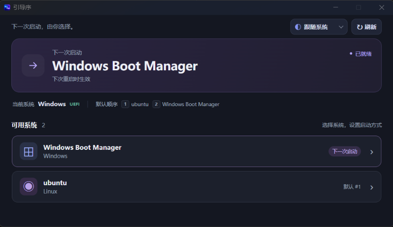

# 引导序 BootPilot

引导序（BootPilot）是一个基于 Rust、Tauri 2、Vue 3 和 TypeScript 的轻量 UEFI 启动项管理工具。它会自动发现当前设备的有效 UEFI 启动项，让用户安全地选择下一次启动的系统。

应用名称会跟随主机语言显示：中文系统显示“引导序”，英文系统显示“BootPilot”。界面支持浅色、深色和跟随系统主题，并提供系统托盘菜单。



## 功能

- 只显示有效的 UEFI 启动项。
- 设置一次性 `BootNext`，下次启动后自动恢复固件默认顺序。
- 在明确确认后设置永久默认启动项。
- 设置后立即重启到选中的系统。
- 显示当前系统、BootNext 和固件默认启动顺序。
- 支持 Windows 和 Linux，支持中文和英文界面。
- 系统托盘支持选择下一次启动、显示、隐藏、刷新和退出。
- 固定窗口尺寸，禁止最大化，界面默认不出现滚动条。

默认模式只做三件事：读取启动项、设置 `BootNext`、重启。用户在明确确认后也可以把某个有效启动项设为永久默认；该操作会修改 `BootOrder`，但不会创建或删除 EFI 启动项，也不会修改 EFI 分区文件。

## 支持系统

- Windows 10/11：通过 `bcdedit /enum firmware /v` 读取，使用 `bcdedit` 设置 `bootsequence`。
- Ubuntu / 其他 Linux：通过 `efibootmgr -v` 读取，使用 `efibootmgr -n XXXX` 设置 `BootNext`。
- 需要 UEFI + GPT。Legacy BIOS 模式下不会执行 EFI 修改。

Linux 下需要系统已经安装并配置 `efibootmgr`。不同发行版的权限策略可能不同，写入 NVRAM 时可能需要管理员权限或 polkit 授权。

## 环境要求

- Rust stable、Cargo
- Node.js 20+、pnpm
- Tauri 2 CLI
- Windows：Visual Studio Build Tools 的 Desktop development with C++ 工作负载，以及 WebView2
- Linux：WebKitGTK、GTK、开发工具；Ubuntu 可安装 `sudo apt install efibootmgr`

Windows 开发机必须能在终端找到 `link.exe`。如果看到 `link.exe not found`，请安装或修复 Visual Studio Build Tools 的 C++ 工具链。

## 开发运行

```bash
pnpm install
pnpm tauri dev
```

仅运行前端预览：

```bash
pnpm dev
```

## 构建

```bash
pnpm tauri build
```

Windows 安装包会生成在：

```text
src-tauri/target/release/bundle/nsis/
src-tauri/target/release/bundle/msi/
```

## GitHub Actions

`.github/workflows/build.yml` 会在推送、Pull Request 或手动运行时自动构建两个平台：

- Linux：AppImage、DEB
- Windows：NSIS 安装包、MSI 安装包

构建完成后，可以在 GitHub Actions 对应运行记录的 Artifacts 中下载安装包。推送 `v*` 格式的标签会额外自动创建 GitHub Release，并将四种安装包作为 Release 附件发布。

例如：

```bash
git tag v0.1.1
git push origin v0.1.1
```

## 代码检查

```bash
cargo test --manifest-path src-tauri/Cargo.toml
pnpm build
```

## 权限

GUI 默认按普通用户启动。真正写入 `BootNext` 或执行重启时，Windows 依赖管理员权限，Linux 依赖 `efibootmgr` / `systemctl` 的权限。当前 MVP 将权限失败清晰返回给界面；权限模块已经独立，为后续增加 Windows UAC helper 或 Linux polkit helper 保留位置。

## 安全模型

- 所有系统命令使用 Rust `Command` 和参数数组，不经过 `cmd /c` 或 `sh -c`。
- Windows ID 只接受 GUID；Linux ID 只接受四位十六进制 Boot ID。
- 修改前端选择不会立即重启，必须经用户确认。
- `set_boot_next_and_reboot` 只有在设置成功后才会执行重启；设置失败绝不重启。
- 永久默认操作会先重新扫描并验证目标，Windows 使用 BCD `displayorder /addfirst`，Linux 使用保留其余项的 `efibootmgr -o`。
- 不会自动删除无效项，不会写入未知 NVRAM 变量。

## BootNext 原理

`BootOrder` 是永久默认顺序，`BootNext` 是固件只使用一次的下一次启动项。引导序只设置 `BootNext`，所以设备完成下一次启动后，后续重启会回到固件原本的 `BootOrder`。

## 项目结构

```text
src/                       Vue 3 + TypeScript UI
src-tauri/src/boot/        统一模型、Trait、Windows/Linux 实现、解析器
src-tauri/src/commands/    Tauri commands
src-tauri/src/privilege/   UAC / polkit 的权限扩展边界
src-tauri/src/system/      系统信息和重启边界
```

## 测试

解析器包含英文和中文 `bcdedit`、`efibootmgr`、BootCurrent、BootNext、BootOrder、EFI 路径、未知和无效启动项测试：

```bash
cargo test --manifest-path src-tauri/Cargo.toml
```

## License

本项目使用 [MIT License](LICENSE)。你可以自由使用、修改和分发本项目，但需要保留许可证和版权声明。
